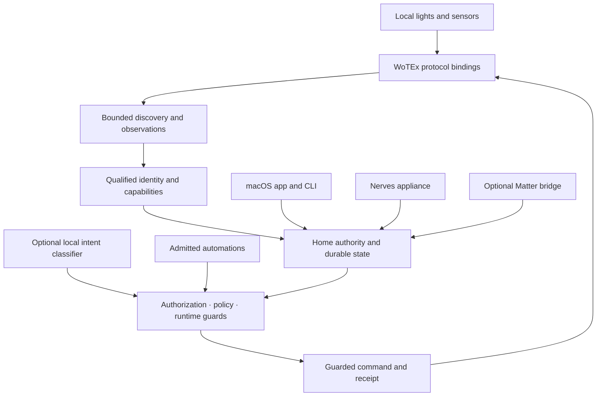

# WoTEx Home

> [!WARNING]
> **WoTEx Home is experimental.** The product described below is the target
> contract, not a claim that its device paths are physically qualified or that
> it is a certified safety system. The [specifications](docs/specs/WOH-index.md)
> define the finished system; the [implementation plan](docs/plans/implementation.md)
> and [hardware qualification ledger](docs/provenance/hardware-qualification.md)
> record the work and evidence still needed. Smoke detection and sirens must
> work independently of Home.

**Home control that stays at home.**

WoTEx Home is a local home controller built on Elixir/OTP and the WoTEx
Web of Things ecosystem. It brings lights, sensors and automation under one
operator-owned authority, with a native macOS application and a Nerves
appliance profile. A vendor cloud, an AI model and a working internet connection
are never prerequisites for ordinary control.

Home treats a device report, a requested change and a confirmed physical result
as different facts. That distinction matters during lost replies, restarts and
network partitions: the system can tell you what it knows without pretending a
command definitely happened.

## Architecture

WoTEx owns reusable protocol mechanics. Home owns household meaning: which
physical Thing was enrolled, which capabilities it has, who may use them and
which current rules apply. A discovered name or matching profile alone cannot
make a device controllable.

## What Home provides

| Part | Finished behavior |
|---|---|
| Local device control | Exact, qualified light and switch capabilities with fresh observations and guarded writes |
| Sensor visibility | Read-only safety-sensitive reports, including the initial smoke-detector path, without taking over the device's own alarm |
| Automation | Rules admitted against declared semantics, then checked again against current state before every effect |
| Durable outcomes | Scoped request receipts that distinguish held work, protocol acceptance, reported state and unknown physical outcome |
| Local interfaces | One authority shared by the macOS app, CLI, appliance and optional ecosystem clients |
| Natural language | An optional offline DistilBERT adapter that proposes a bounded intent; it never grants permission or bypasses the command gate |
| Recovery | Versioned backups, fenced authority transfer, release inventories and explicit rollback qualification |

These are product contracts. Individual implementation and acceptance states are
tracked by the [specification catalogue](docs/specs/catalogue.yaml), rather
than inferred from this table.

## How control earns authority

A new device starts as untrusted evidence. Home observes it through a bounded
local session, compares its exact identity and firmware against a qualified
profile, and asks an authorized operator to review enrollment. Unknown or
conflicting evidence stays unresolved. The resulting Thing gets only the
capabilities and grants that were actually reviewed.

A request then passes the same command gate whether it came from a button,
CLI, admitted automation, Matter client or local classifier. The gate checks
current credentials, grants, revisions, capability bounds and safety
invariants. It records intent before dispatch and rechecks the authority basis
at the physical boundary. A timeout is recorded as uncertainty, not success.

Automations use three-valued facts: unknown stays unknown. A bounded verifier
can reject a conflicting draft, but a search that finds no counterexample is
not by itself a proof that the draft is safe. Only a rule with the required
positive evidence can become active; runtime guards remain in force after
admission. See the [automation contract](docs/specs/WOH.04-state-automation.md)
and [verification contract](docs/specs/WOH.07-formal-verification.md).

## Local hardware and hosts

The first physical qualification targets are older EU LIFX bulbs and an Aqara
smoke detector without an Aqara hub. LIFX provides the initial local lighting
path. The smoke detector is an observation source: its standalone detection
and siren do not depend on Home, a radio coordinator, the network, inference or
formal verification. Hue and Shelly integrations follow exact device and
firmware qualification, rather than brand-wide assumptions. The
[hardware contract](docs/specs/WOH.11-hardware-qualification.md) and
[lab catalogue](docs/labs/README.md) describe the required tests.

The native macOS application is a client of an opt-in background Home service.
Closing a window does not stop that service. The Raspberry Pi 4 Nerves profile
runs the same Home semantics as a local appliance and keeps private state on
persistent storage. Each host has its own lifecycle, credential and recovery
qualification. Optional Matter export uses the same authority and receipt
model; it does not create a second path to a device.

## Start here

| If you want to… | Read… |
|---|---|
| Understand the complete product contract | [Specification index](docs/specs/WOH-index.md) |
| See how the parts fit together | [System architecture](docs/architecture/system.md) |
| Follow implementation and open gates | [Implementation plan](docs/plans/implementation.md) |
| Work on the macOS host | [Native host guide](native/macos/README.md) |
| Work on the appliance | [Nerves guide](native/nerves/README.md) |
| Qualify a physical device | [Lab catalogue](docs/labs/README.md) |
| Review release and provenance rules | [Release contract](docs/specs/WOH.16-release-recovery.md) |

## Develop locally

The repository pins Elixir and OTP in `.tool-versions`. Run `mix deps.get`,
`mix test` and `mix woh.spec.check` for the Elixir core and specification
catalogue. `mix woh.isolated.smoke` builds a clean committed source archive
with locally cached dependencies and checks the offline release path.

The optional model experiment uses `mix woh.intent.train` with a pinned local
DistilBERT base and writes its candidate under ignored `_build/` storage.
`mix woh.intent.artifact.check SLOT` verifies the candidate's manifest and
label contract; a passing check does not admit a model to production. Host,
release and hardware procedures live in the linked guides.

## Repository map

| Path | Contents |
|---|---|
| `lib/` | Home semantics, authority, durable store and Mix tooling |
| `priv/` | Authored corpus and pinned product metadata inputs |
| `native/macos/` | Native application and local client fixtures |
| `native/nerves/` | Raspberry Pi 4 appliance project |
| `docs/specs/` | Normative product contracts and acceptance cases |
| `docs/labs/` | Physical qualification procedures |
| `vendor/wotex_udp/` | Pinned, bounded UDP socket owner and its legal notices |
| `vendor/ex_maude/` | Pinned formal-verification dependency and notices |

## License

A project-wide license has not yet been declared. Vendored code and model
inputs retain their own licenses; see the
[release provenance notes](docs/provenance/license-inputs/README.md) before
redistributing an assembled build.
