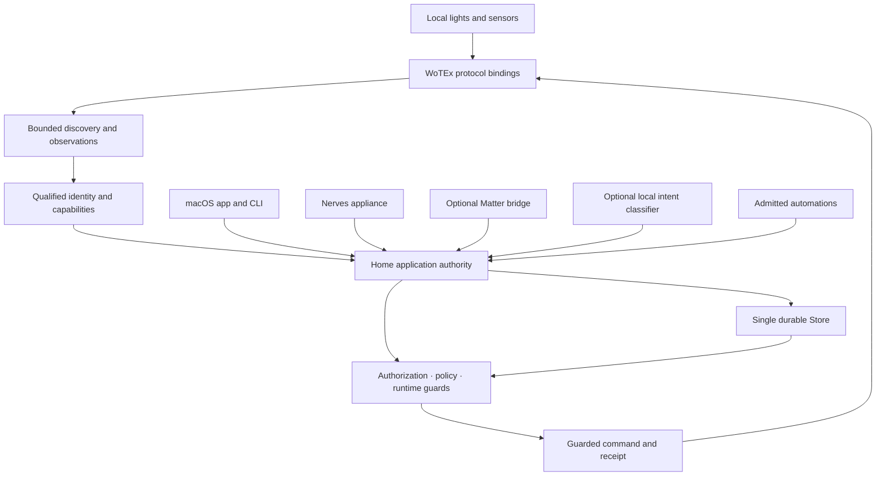

# WoTEx Home

> [!WARNING]
> **WoTEx Home is experimental.** The product described below is the target
> contract, not a claim that its device paths are physically qualified or that
> it is a certified safety system. The [specifications](docs/specs/WOH-index.md)
> define the finished system; the [implementation plan](docs/plans/implementation.md)
> and [hardware qualification ledger](docs/provenance/hardware-qualification.md)
> record the work and evidence still needed. Smoke detection and sirens must
> work independently of Home.

**Home control that stays at home.**

WoTEx Home is a local home controller built on Elixir/OTP and the WoTEx
Web of Things ecosystem. It brings lights, sensors and automation under one
operator-owned authority, with a native macOS application, an optional shared
Linux server and a Nerves appliance profile. A vendor cloud, an AI model and a
working internet connection are never prerequisites for ordinary control.

The target works entirely on the Mac while its controller is awake and running.
An optional server can share an existing Linux/Pi machine and keep schedules
running while the laptop is off; a dedicated appliance image is another choice.
Supported new sensor models/channels should be imported as reviewed profile
data. Development shared-server delivery and an opt-in core paired LAN transport
are implemented. Installed pairing/native selection, complete autonomous
scheduling and broader sensor mappings remain successors; see the
[delivery plan](docs/plans/local-controller-delivery.md) and
[research](docs/plans/local-controller-research.md) for their scope and gates.

Home treats a device report, a requested change and a confirmed physical result
as different facts. That distinction matters during lost replies, restarts and
network partitions: the system can tell you what it knows without pretending a
command definitely happened.

## Architecture

WoTEx owns reusable protocol mechanics. Home owns household meaning: which
physical Thing was enrolled, which capabilities it has, who may use them and
which current rules apply. A discovered name or matching profile alone cannot
make a device controllable.

This repository is one Mix/OTP application, not a monorepo of Home packages.
Folders under `lib/wotex_home/` are namespace and trust boundaries. Transport
adapters call `WotexHome.Authority`; that application boundary sequences pure
decisions and the single durable Store. Store collaborators receive its owned
SQLite handle only for the duration of a call and cannot open another writer.

LIFX enrollment follows the same boundary. The private API accepts references
to one operator-bound, host-held capture and one immutable compiled profile;
it never accepts caller-authored packet evidence or capability declarations.
Enrollment records legacy TOFU only. Physical qualification, target grants and
device dispatch remain separate decisions. Trusted foreground setup can issue
a first controller credential for an enrolled Thing. Adding a later target
atomically replaces that credential and invalidates its pending work, so a
previously distributed bearer never silently gains a wider grant.

An explicit LIFX refresh accepts only an enrolled Home Thing ID. The Store
resolves the caller's current grant, stable binding and declaration; the
selected-interface owner performs fresh discovery before unicast and returns
only correlated reports to the application authority. The Store repeats the
credential, grant and revision checks at commit, so callers never choose a
device endpoint or persist a stale authorization basis.

An optional WIT component host now supports separately installed, import-free
payload previews outside the BEAM. Its results are explicitly unqualified;
production profile activation and signed/board containment remain separate gates.
See the [component contract](docs/specs/WOH.17-component-extensions.md).

The accepted next build direction is independently delivered profile data under
[WOH.18](docs/specs/WOH.18-portable-profile-admission.md), using existing host
bindings and Authority/Store admission. The [shared plan](docs/plans/portable-profile-admission.md)
keeps the WIT runtime optional and reuses existing bounded rule source. Bounded
inert data import, private immutable custody and durable local digest approvals
are implemented. Approval remains separate from target selection. Trusted
selection can enroll a new LIFX target or replace its compatible declaration
under maintenance, retaining original history and requiring new qualification.
Changed firmware gets a fresh reviewed basis. Closed local socket and CLI
commands now support import, preparation, select/revoke, private receipt/review
status and Store-owned collection. The native panel composes import, approval, host-held capture, reviewed
selection, revocation and original operation recovery. The shared host now supervises
private profile custody and one-use reviews after Store ownership.

## What Home provides

| Part | Finished behavior |
|---|---|
| Local device control | Exact, qualified light and switch capabilities with fresh observations and guarded writes |
| Sensor visibility | Read-only safety-sensitive reports, including the initial smoke-detector path, without taking over the device's own alarm |
| Automation | Rules admitted against declared semantics, then checked again against current state before every effect |
| Durable outcomes | Scoped request receipts that distinguish held work, protocol acceptance, reported state and unknown physical outcome |
| Local interfaces | One authority shared by the macOS app, CLI, appliance and optional ecosystem clients |
| Natural language | An optional offline DistilBERT adapter that proposes a bounded intent; it never grants permission or bypasses the command gate |
| Recovery | Versioned backups, fenced authority transfer, release inventories and explicit rollback qualification |

These are product contracts. Individual implementation and acceptance states are
tracked by the [specification catalogue](docs/specs/catalogue.yaml), rather
than inferred from this table.

## How control earns authority

A new device starts as untrusted evidence. Home observes it through a bounded
local session, compares its exact identity and firmware against a qualified
profile, and asks an authorized operator to review enrollment. Unknown or
conflicting evidence stays unresolved. The resulting Thing gets only the
capabilities and grants that were actually reviewed.

A request then passes the same command gate whether it came from a button,
CLI, admitted automation, Matter client or local classifier. The gate checks
current credentials, grants, revisions, capability bounds and safety
invariants. It records intent before dispatch and rechecks the authority basis
at the physical boundary. A timeout is recorded as uncertainty, not success.
The first LIFX direct-power worker also requires an explicit host dispatch
flag and a qualified Store profile. It runs under supervision, treats an ACK
as protocol acceptance only, and closes the durable receipt from a separate
correlated readback. The shipped default remains disabled.

Automations use three-valued facts: unknown stays unknown. A bounded verifier
can reject a conflicting draft, but a search that finds no counterexample is
not by itself a proof that the draft is safe. Only a rule with the required
positive evidence can become active; runtime guards remain in force after
admission. See the [automation contract](docs/specs/WOH.04-state-automation.md)
and [verification contract](docs/specs/WOH.07-formal-verification.md).

## Local hardware and hosts

The first physical qualification targets are older EU LIFX bulbs and an Aqara
smoke detector without an Aqara hub. LIFX provides the initial local lighting
path. The smoke detector is an observation source: its standalone detection
and siren do not depend on Home, a radio coordinator, the network, inference or
formal verification. Hue and Shelly integrations follow exact device and
firmware qualification, rather than brand-wide assumptions. The
[hardware contract](docs/specs/WOH.11-hardware-qualification.md) and
[lab catalogue](docs/labs/README.md) describe the required tests.

The native macOS application is a client of an opt-in background Home service.
Closing a window does not stop that service. The Raspberry Pi 4 Nerves profile
runs the same Home semantics as a local appliance and keeps private state on
persistent storage. Each host has its own lifecycle, credential and recovery
qualification. Optional Matter export uses the same authority and receipt
model; it does not create a second path to a device.

## Start here

| If you want to… | Read… |
|---|---|
| Understand the complete product contract | [Specification index](docs/specs/WOH-index.md) |
| See how the parts fit together | [System architecture](docs/architecture/system.md) |
| Follow implementation and open gates | [Implementation plan](docs/plans/implementation.md) |
| Build portable profiles | [Data admission plan](docs/plans/portable-profile-admission.md) and [consolidated research](docs/plans/extension-consolidation.md) |
| Build optional WIT helpers | [Component plan](docs/plans/component-extensions.md) and [native author guide](native/components/README.md) |
| Work on the macOS host | [Native host guide](native/macos/README.md) |
| Work on the appliance | [Nerves guide](native/nerves/README.md) |
| Qualify a physical device | [Lab catalogue](docs/labs/README.md) |
| Review release and provenance rules | [Release contract](docs/specs/WOH.16-release-recovery.md) |

## Develop locally

The repository pins Elixir and OTP in `.tool-versions`. Mix uses neighboring
`ex_maude` and `wotex/packages/wotex-udp` checkouts when present. Otherwise it
fetches the exact Git commits in `mix.exs` and `mix.lock`. Set
`WOTEX_HOME_GIT_DEPS=1` to use those pins even with sibling checkouts; CI does
this. After `mix deps.get --check-locked`, run `mix woh.lifx.registry.fetch`
to provision the digest-pinned, Git-ignored vendor metadata used by the profile
tests. Run `mix hex.audit`,
`mix format --check-formatted`, `mix compile --warnings-as-errors`,
`mix woh.spec.check` and `mix test` for the Elixir core and specification
catalogue. Before `mix woh.isolated.smoke`, run
`WOTEX_HOME_GIT_DEPS=1 mix deps.get --check-locked` to cache the pinned Git
sources. The smoke task then builds a clean committed source archive with
locally cached dependencies and checks the offline release path.

When a restricted environment prevents Mix's TCP PubSub launcher, run
`elixir bin/test.exs` with already-built locked test dependencies. It compiles
fresh Home source in a private temporary directory, rejects compiler warnings,
checks the spec catalogue and runs the full suite without using cached Home
BEAMs. `elixir bin/test.exs --socket-free` explicitly excludes only tests tagged
`requires_socket`; it is a logic/database check, not OS transport or hardware
qualification. Normal CI still runs every socket test. Test-file paths can be
supplied for a focused run.
`--firmware-host` also compiles and tests the pure Nerves host probes against
the fresh Home code. This does not cross-build firmware or qualify a board.

From a clean committed tree, `elixir bin/build.exs --dependency-env prod`
builds a fresh unsigned Home OTP release without Mix's TCP launcher, using
the selected prebuilt dependency cache. Use `--dependency-env test` to select
that cache explicitly. It checks packaged Store/CLI/verifier startup and emits
verified component, SPDX and file inventories under a new private
`_build/socket-free-prod/` directory. It is not a cache-free dependency build,
installed-host socket test, signing step or hardware qualification.

The optional model experiment uses `mix woh.intent.train` with a pinned local
DistilBERT base and writes its candidate under ignored `_build/` storage.
`mix woh.intent.artifact.check SLOT` verifies the candidate's manifest and
label contract; a passing check does not admit a model to production. Host,
release and hardware procedures live in the linked guides.

## Repository map

| Path | Contents |
|---|---|
| `lib/wotex_home/authority.ex` | Transport-independent Home use cases |
| `lib/wotex_home/` | One application's domain namespaces, adapters and owned processes |
| `lib/wotex_home/durable/store/` | Stateless internals called only by the single Store owner |
| `lib/mix/` | Repository and release tooling, not runtime product packages |
| `priv/` | Authored corpus and pinned product metadata inputs |
| `native/macos/` | Native application and local client fixtures |
| `native/nerves/` | Raspberry Pi 4 appliance project |
| `docs/specs/` | Normative product contracts and acceptance cases |
| `docs/labs/` | Physical qualification procedures |
| `mix.exs` and `mix.lock` | Exact Git revisions for WoTEx UDP and ex_maude, with local development overrides |
| `docs/provenance/license-inputs/` | Pinned legal inputs copied into releases |

## License

A project-wide license has not yet been declared. Dependency code and model
inputs retain their own licenses; see the
[release provenance notes](docs/provenance/license-inputs/README.md) before
redistributing an assembled build.
