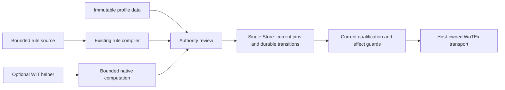

# System architecture

Version: 0.3.8. Target design; hardware and implementation evidence are separate.

## Two planes, one physical authority

The control plane validates immutable candidate configurations. The execution plane observes devices and dispatches only current, authorized intents. Verification never holds the dispatcher hostage and the dispatcher never activates its own unreviewed fallback rules.

```text
native UI / CLI / Matter / optional local language input
                         |
                 authenticated Home API
                         |
       +-----------------+--------------------+
       |                                      |
 draft -> checks -> proof receipts       observations / requests
       |                                      |
 immutable admitted revision          state + invariant guards
       +-----------------+--------------------+
                         |
              one durable execution owner
                         |
       profile adapters -> WoTEx -> local protocols
```

## Ownership

Home's pure modules own typed rules, effect domains, state reduction, planning and policy. A host owns the SQLite writer, credentials, radio/socket lifecycles, clock, schedulers and supervised workers. WoTEx stays consumer-neutral. Model compilation for Home belongs here; generic checker result/receipt mechanics belong in ex_maude. DistilBERT is a required demonstration input profile, not the control authority. Refpath remains an optional client.

Home is one Mix/OTP application. Directories below `lib/wotex_home/` are
namespaces and trust boundaries, not separately released packages. Runtime
dependencies point inward through these layers:

```text
transport adapters (Unix socket, CLI, future Matter/HTTP)
                         |
             application authority/use cases
                 /                    \
       pure domain decisions       owned processes
                                  /               \
                       one durable writer     device sessions
```

Adapters decode, enforce transport limits and encode results. Application use
cases sequence work. Pure domain modules decide without I/O. The durable writer
alone owns SQLite and delegates bounded transaction logic to internal modules;
those modules never retain the connection. Historical DDL and migration order
live in a stateless schema collaborator invoked synchronously by that owner.
The same read-only integrity gates validate startup and exported snapshots;
bounded principal-scoped state projections never allocate revisions.
Device sessions own sockets and protocol timing but receive no database or
credential authority.

| Store responsibility | Stateless internal boundary |
|---|---|
| Historical DDL and semantic consistency | `Schema`, `Integrity` |
| Current principal/grant/Thing reads | `Access` |
| One global revision and event sequence | `Journal` |
| Canonical request/retry/cancellation | `RequestLedger` |
| Immutable rejected/pending candidate history | `CandidateWriter` |
| Admission, handoff, settlement and no-send recovery | `ExecutionWriter` |
| Store-clock attempt history and compiled rate/spacing checks | `AttemptGuard` |
| Non-refundable single-effect explicit-request roots | `CausalLedger` |
| Enrollment, principal authority, overrides, qualification | Domain-specific writers |
| Reports, source epochs and enrolled refresh guards | `ObservationWriter`, `RefreshWriter` |
| Scoped health/review/state projections | Read models |
| Current authenticated Store-clock fact inputs | `FactReadModel` |

The process retains the connection and host lock, transaction commit, credential
and claim-token issuance, live caller monitors and monotonic origins. Internal
modules receive borrowed handles synchronously and never own another process,
database connection or device channel. These are Home application boundaries,
not independent packages.

Direct-power admission, claim and final handoff repeat the attempt guard inside
the same Store transaction as their state transition. The host owns the clock;
the profile owns closed compiled limit data, and the stateless reader owns no
counter or timer. Only a committed handoff consumes an attempt. Old/untimed
history requires a full new-boot window, while current terminal/unknown rows
retain their original timestamps. This supplies bounded attempts, not physical
dwell or an active automation authority.

The same writer binds each new explicit-request root to its immutable scoped
receipt and creation event. Queue acceptance reserves the one depth-one effect;
claim and handoff check the original reservation again. This is separate from
the handoff-based rate charge. Cancellation, fencing, worker loss and restart
retain the reservation even when an execution row is deleted. Schema-14
migration labels historical roots as legacy and conservatively reserves known
queue/execution history. Missing or ambiguous queue provenance blocks execution
without fabricating a journal event. These roots are neither public command
tokens nor rule admission, and no device report acquires proven causal lineage.

Candidate checks run through Authority's bounded review gate, outside Store's
transaction. The writer rechecks current credentials, epoch, global revision
and the complete scoped declaration/resource snapshot before retaining an
immutable record. Exact retries bypass the checker and return the original
principal-private outcome. History contains no active pointer, scheduler,
outbox entry or device authority; a pending basis is not an admitted rule.

The pure Home compiler binds complete closed source to canonical IR. Both draft
evaluation and the native negative-conflict projection consume those entries;
the latter records its omissions rather than claiming full Home semantics.
The v3 proposal basis binds compiler/source/IR and the packaged application
closure, and repeats independent finite correspondence. None of these modules
owns a process, Store handle, credential, scheduler or physical command channel.
Durable admission and guarded activation remain separate writer-owned work.

Observation receipt timing is a writer-owned provenance boundary, separate from
the adapter's source and receipt metadata. The writer stamps journal/current
pairs atomically; duplicates and failed transactions cannot renew them. The
bounded fact read reauthenticates permissions/grants, matches the exact original
journal and current declaration, and uses only the Store's own boot clock.
Untimed and old-boot reports remain unknown. It owns no process or database and
returns preview input, not a dynamic invariant policy or command capability.

## Supervision

Use separate restart domains for persistence/authority, drivers, read APIs, optional inference and qualification. If the authority/writer fails, dependent dispatchers stop before restarting. The application authority is stateless; its bounded gates and writer-facing services are supervised in the same restart domain. One crashed model worker must not restart a Zigbee network. Bounded work pools prevent radio floods, model jobs or slow UI readers from exhausting the controller. Protocol processes are explicit children; loading a dependency starts nothing.

The first direct-power path uses a host-owned `Task.Supervisor`. Each temporary
worker opens and closes its selected-interface datagram owner, and the Store
monitors that same task as the claim owner. The worker receives only narrow
claim, handoff, ACK, readback and uncertainty capabilities. It cannot transfer
its token to another process, and the pure LIFX exchange has no Store reference.
This internal path is disabled unless trusted host configuration explicitly
enables it; no local-socket operation can start a device worker.

The driver boundary resolves credentials per operation and admits only finite typed messages. Domain logic never handles serial ports or UDP sockets. Device-family mappings do not leak into Swift.

## State and deployment

The baseline is one writer on one host with durable snapshots, a domain journal and an outbox; see WOH.14. There is no distributed database, active-active controller, runtime source-code plugin loader or mandatory MQTT broker. MQTT is selected only for devices that use it. Model artifacts and TD context/schema registries are installed locally and pinned before operation.

The first installed macOS host keeps an opt-in per-user background controller alive independently of windows. Unlike an art frame, a home may need live automation while its UI is closed. macOS sleep/logout/Keychain lock still have explicit availability limits. Nerves later supplies the same authority as an appliance; switching hosts is an authority-transfer procedure, not starting another copy.

## Prevention claim

Rejected drafts have no physical side effects. Admitted rules retain runtime guards, causal budgets and current-state checks. This prevents the classes actually specified and tested; it is not a claim that arbitrary hardware or unmodeled environments are mathematically safe.

## Portable profiles and optional components

[ADR 0010](../decisions/0010-data-first-profile-admission.md) puts independently
delivered immutable profile data first. A closed data artifact selects an existing
host binding; Home derives capabilities, risk, units and protocol behavior.
Existing bounded rule source continues through the Home compiler and durable
rule lifecycle. Optional executable helpers need a named mapping benefit.



Review, matching, local approval and physical qualification are distinct.
Filesystem custody owns immutable bytes, never an active pointer. Store alone
owns selection/trust generations, scoped operation history and revocation. The
first selection workflow uses global maintenance; unsent work is invalidated,
rules suspended and handed-off uncertainty retained. Old facts cannot become
current and existing grants cannot gain wider operations. Recovery inventories
external dependencies and stays
quarantined. [WOH.18](../specs/WOH.18-portable-profile-admission.md) specifies this
planned lifecycle; schema 18 and compiled profile selection remain current.

[ADR 0009](../decisions/0009-wit-component-extensions.md) chooses optional immutable
WIT components executed in disposable native Wasmtime processes outside the
BEAM. OTP owns admitted-job capacity and retirement; generated native bindings
terminate WIT and a closed binary Port codec joins Elixir. No guest imports or
ambient WASI services exist in the first world. Authority exposes only an
explicit unqualified pure preview; installation creates no active profile,
observation or effect. The Store remains the sole future activation/revocation
writer, and existing compiled enrollment/qualification paths retain their full
code bindings. This is a portable binary extension boundary; the prohibition
on evaluating runtime source scripts remains. Production lifecycle and actual
signed/board containment follow [WOH.17](../specs/WOH.17-component-extensions.md).
Cancellation currently releases the OTP slot before observing native exit;
production process capacity/retirement, compiler/lifting allocations and actual
OS containment remain helper gates. Ordinary data profiles and offline Home use
must work without this runtime. The [shared plan](../plans/portable-profile-admission.md)
owns the production sequence; the component plan owns optional helper work.
