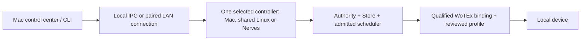

# Local controller delivery plan

Version: 0.1.6. Updated: 2026-10-10. Accepted target sequence; development Linux delivery, narrow temporal mechanisms, private TLS identity, explicit core LAN transport and bootstrap clients are partial, with installed pairing, expanded admission and sensor mapping successors unfinished.

## Product outcome

Install the Mac app, choose local operation, enroll supported devices, review
and activate a schedule, and use the control center without a cloud. If the
operator wants execution while the laptop is off, install the same controller
on an existing supported Linux/Pi machine and pair the Mac. A dedicated
appliance image is an optional alternative. Add supported models/channels by
importing reviewed profile data; new protocols/privileged semantics have named
extension boundaries. Technical trust/receipt detail is exposed when needed to
make a decision, not as a mandatory configuration exercise on every screen.

The [research record](local-controller-research.md) explains decisions and
alternatives. [WOH.19](../specs/WOH.19-shared-server-host.md) owns the shared host;
existing contracts own Authority, Store, safety and recovery. This plan extends
[the implementation order](implementation.md), not a second application or an
instruction to alter sibling repositories. Current in-progress durable transfer
work and existing physical/default-disabled gates are preserved.

## Current facts and dependencies

| Mechanism | Current boundary | Required successor |
| --- | --- | --- |
| Local host/UI | Private UDS, development Mac bundle; signed installed lifecycle missing | Fresh-account install/custody/lifecycle and coherent standalone workflows |
| Portable profiles | Closed LIFX power v1 and shared/native lifecycle | Separately versioned standard multi-channel mappings; no v1 broadening |
| Semantics | Executable Light/SmokeDetector subset | Generic channel projection with exact common sensor contracts |
| Automation | Explicit single-rule admission, temporal calculation/guard correspondence, durable occurrences and opt-in delivery owner; autonomous/composed admission and installed clock qualification missing | Complete admitted temporal execution and then reported edges |
| Linux server | Development arm64 payload and resumable initial/repeat/uninstall; updates, hard disk containment, amd64 and installed qualification missing | Qualified Debian arm64/amd64 service with coexistence evidence |
| Remote client | Frozen formats, finite confirmation, atomic provisioning, private identity, bounded core Host listener/UDS-TLS parity and OTP/Apple bootstrap clients including real Authority pairing | Installed identity setup/renewal/private invitation transfer, native ordinary TLS/Keychain/controller selection |
| Appliance | Pi 4 cross-built wired/private-UDS image | Unique first-boot custody, paired control and actual board/storage qualification |
| Executable helpers | Import-free power preview; retirement/native containment gaps | Named decoder need and full host containment before production |

The host arrangement keeps clients outside the execution owner:

The implementation graph is A → B → C for a usable standalone controller.
D follows B; E follows B/D; F joins C/E for server scheduling and controller
transfer. G follows B and reuses the same profile lifecycle; H joins C/G for
sensor automation. I reuses E/F on the optional appliance. J is conditional,
never a prerequisite for ordinary profiles or the initial local product.

## Ordered work packages

| Package | Concrete change | Entry and completion evidence |
| --- | --- | --- |
| A — preserve durable ownership | Finish the existing transfer/isolation/recovery/clock and receipt boundary already in the main plan; keep one Store and default-disabled physical dispatch | Current contract/catalogue checks and focused recovery/authority cases; destination cannot activate before actual source retirement/isolation and current trust. Do not weaken unfinished gates to make setup convenient. |
| B — complete one local product path | Finish installed Mac service/credential bootstrap, device/profile review, current control/receipt view and independently qualified direct-light path | H08-T1–T7/H18-T10 and the exact existing LIFX hardware cases. A fresh supported Mac account can operate offline; uncertainty remains visible. Enrollment does not automatically qualify or grant control. |
| C — autonomous time schedules | Implement the closed calendar/interval/countdown successor, independent temporal oracle, durable occurrence schema, current guard joins and schedule author/revision lifecycle; expose draft/review/activate/suspend/next/missed status through Authority/CLI/native UI | H04-T8/T9; canonical schemas/receipt/root/retention encodings and migration fixed before code. Independent DST/clock/crash races plus actual host clock/sleep behavior. Existing explicit admission cannot be reused as temporal proof. |
| D — shared Linux host | Package the same locked core for Debian 13 arm64/amd64; add owned service account/unit, private state/runtime paths, native inventory, local install/update/uninstall/preflight and measured resource bounds | H19-T1/T5–T7. Create `native/linux/README.md` with exact real commands when built; fresh-host offline installation beside an unrelated job. No OS replacement, mandatory container or unreviewed global changes. Start private local setup before enabling LAN. |
| E — paired LAN channel and Mac client | Freeze invitation/bootstrap/TLS/framing fixtures, implement finite local pairing through Authority, scoped credentials, pinned offline identity and controller selection; retain original operations across UI restart | H15-T8/H08-T9 with independent OTP/Apple peers, revoked/lost-response cases, secret-absence audit and real installed headless pairing. Discovery is optional; manual endpoint works. Local effects never fall back when a remote owner is lost. |
| F — optional owner relocation and server operation | Join existing fenced transfer with exact artifact/profile/rule/receipt inventory and new controller association; run server-owned admitted schedules while all clients are off | H19-T2–T4/T8; transfer/restore partition campaigns, original receipt scope, no implicit activation from copied/restored state or dual writer. Same-owner restart resumes only the revalidated retained schedule basis. Mac-off/WAN-off operation and server reboot/power/storage campaigns separately. An offline clock must have a qualified source or explicit local establishment. |
| G — independently authored sensor profiles | Freeze v2 schemas/projection identities and first Zigbee ZCL / local MQTT observation binding contracts; implement common exact sensor capability contracts, multi-channel review/rendering and lifecycle joins | H01-T6/H03-T7/H18-T11/T12; two independent authors, multi-channel sensor, two protocol paths, no Home source/binary edit for subsequent supported models. Public protocol consumer fixtures and actual sensor cohorts recorded separately. Existing v1 bytes and approvals remain valid under their original semantics. |
| H — admitted reported-edge automation | Add current-source baseline/sequence/provenance, debounce, causal lineage and composed rule arbitration to the same runner; connect sensor predicates to the qualified ordinary actuator | H04-T10 plus existing T1–T7. Initial/retained/stale/replayed reports cannot fire; unknown blocks; source changes reset baselines; independent trace oracle and exact sensor-to-actuator physical qualification. More than one active schedule/rule requires the corresponding composed admission basis. |
| I — optional appliance delivery | Add per-install identity/bootstrap custody and paired channel to the selected Nerves image, preserving host differences; provide explicit image install and offline update/recovery workflow | Existing H09/H16 board cases, H19 semantic parity, installed pairing and actual power-cut/radio tests. No Pi 5 port is required to finish this track. Image flashing never replaces shared-service setup. |
| J — conditional decoder/adapter | Demonstrate a real proprietary mapping unsupported by standard data. First evaluate a reviewed binding, then a separately typed import-free decoder; separately evaluate native SDK/stream adapter or qualified Refpath public reuse | H17-T9 and existing containment/lifecycle cases. Full native memory/process retirement before production. New I/O imports/resource worlds need an explicit contract; no downloaded BEAM/NIF/code evaluation. Ordinary supported data works with the runner absent. |

Each package is divided into reviewable local commits: closed contract/fixtures
first, then pure mechanism, durable/current-authority joins, external adapter,
client flow, and actual host/device evidence as applicable. Use existing concise
commit conventions, no pushes and no dependency updates as a side effect.
This documentation task itself does not claim those future commits exist.

## Implementation-entry decisions

These are concrete design artifacts required before the affected code, not
unresolved product direction or permission to bypass a gate.

| Entry | Artifact to freeze | Required rejection examples |
| --- | --- | --- |
| C | Versioned schedule JSON/IR, occurrence/root/receipt encoding, generation/watermark retention, temporal oracle and actual next migration version | Old explicit proof, repeated DST time, clock rollback, future/stale occurrence, revoked author, duplicate tick and expired unsent work |
| D | Release/service manifest, owned path/account/unit layout, exact OS/native cohort, measured CPU/memory/process/disk settings and sandbox exceptions | Wrong architecture, symlink/conflicting ownership, missing radio access, ENOSPC and restart exhaustion |
| E | Closed invitation and bootstrap request/response format, TLS certificate chain/name/pin profile, one-use transaction and private setup custody | Secret replay, crash/lost delivery, changed pin/name, uncertain clock, zero-RTT and target grant widening |
| G | Public binding/semantic IDs and pins, per-binding v2 JSON schema, canonical projection, conversion/source-reset vectors, migration/backup manifests | Unsupported security/unit/selector, data containing code/endpoint/key, invalid sentinel, retained replay and expanded old grant |
| H/J | Exact proof/world/resource/lifecycle contract and independently authored evidence | False decoder facts, incomplete process retirement, unauthorized import, feedback loop and producer-only qualification |

The [pairing wire entry](../specs/controller-pairing-wire-v1.md) now freezes E's
invitation/request/response grammar with exact original/access and framing
fixtures. Its codecs provide syntax only. Separate
[TLS bootstrap clients](../specs/controller-tls-bootstrap-v1.md) now check
chain/SAN/pin/clock and bounded framing through independent real TLS peers.
The [local approval records](../specs/controller-pairing-review-v1.md) bind the
complete original, Store boot, authority scope, revision and exact approved
access through independent canonical/digest fixtures.
Trusted read-only Authority scope and a finite transient review owner now bound
pending/backoff, exact approval/checkout and owner/deadline cleanup, without
provisioning itself. Separate
[schema-28 atomic consumption](../specs/controller-pairing-consumption-v1.md)
now joins approved provisioning, one-use original history and final live guards,
with trusted exact status/revocation after lost delivery. The
[private identity foundation](../specs/controller-installation-identity-v1.md)
now generates independent TLS keys and signed stable IDs in one sealed,
nonreplacing record, with OTP/OpenSSL/Apple checks. The
[explicit core listener](../specs/controller-listener-v1.md) now joins trusted
Host configuration, selected binding/lifetime/capacity fences, shared UDS/TLS
Authority dispatch and finite real pairing. Actual Store receipts retain
original status after lost mutation delivery, and independent Apple clients
obtain one real default-read credential then refuse consumed replay. Installed
identity setup/renewal/private invitation transfer and native ordinary
TLS/Keychain/controller selection remain next; these development checks do not
discharge H15-T8 or H08-T9.

No speculative schema number, API operation name, Zigbee network key, private
hardware fingerprint or source dependency is reserved in prose. Runtime code
uses checked-in executable schemas/fixtures and public producer interfaces,
never parses these Markdown files. Unsupported producer behavior remains a
specific integration blocker; it is not implemented twice inside Home.

## User workflow and release gates

The default onboarding is install → enable local controller → choose a local
device/profile → review identity/capabilities → explicitly grant access →
control/read status → review and activate a schedule. Optional server setup is
install verified package on an existing supported host → create a private
pairing invitation → connect the Mac → transfer an existing home through the
fenced workflow, or commission a new home. Profile authoring is create from a
supported binding/schema → validate offline → import → review/select → obtain
any required exact qualification. Each step offers a concrete decision and
honest result; authors do not need to write an application plugin for standard
sensor channels.

| Release claim | Required gates |
| --- | --- |
| Ready for local hardware testing | B's installed custody and explicit device path; physical dispatch enabled only for the exact qualified scope. C is required to claim autonomous scheduling. Unsupported safety work stays disabled. |
| Usable standalone local product | B/C, common offline/receipt/recovery cases, current host clock and signed installed lifecycle. No Pi, Refpath, Wasm or cloud required. |
| Optional shared-server product | D/E/F plus existing release/recovery gates on each supported architecture; coexistence, Mac-off operation and no dual authority. |
| Extensible sensor product | G; H additionally required for autonomous sensor-triggered effects. Two independent model additions prove the claimed author workflow without rebuilding Home. |
| Optional appliance product | I's real board, boot/storage/radio and private first-boot custody evidence; a cross-build supplies packaging evidence only. |

The final acceptance walkthrough blocks WAN/public DNS/registries, removes
optional engines, closes all UI clients, restarts the owner, changes clock/DST,
imports/upgrades/revokes a profile, loses a mutation reply, contends for a radio,
restores an old backup and partitions the old owner during transfer. Record
expected receipts, missed occurrences and affected capability limits. For the
shared host, run an unrelated workload throughout. Bench qualification must
identify exact public cohort/private custody references without leaking device
identities into tracked fixtures.

After each implemented package, rerun the source/status audit and update only
the implemented and evidenced scope. New support failures refine the owning
contract and fixtures; more prose or a passing compiler cannot close physical
or installed-delivery obligations.
