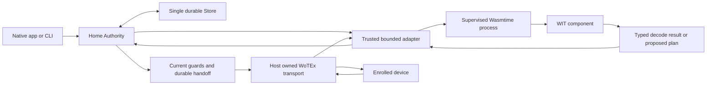

# WIT and WebAssembly components for Home plugins

Reviewed: 2026-10-03. Status: historical research proposal, reconciled below.
Repository baseline: `6c00eac`.

The production recommendation is now refined by [ADR 0010](../decisions/0010-data-first-profile-admission.md):
portable profile data first, existing rule-source admission, optional executable
helpers for a demonstrated mapping need. The [consolidation](extension-consolidation.md)
accounts for this report, the later preview and the incoming data-first proposal.
The proposals/milestones below retain their original baseline and do not override
the current [portable profile plan](portable-profile-admission.md).

This report evaluates portable extensions for Home device profiles and protocol
logic. Its original recommendation was to define typed WIT interfaces and execute
WebAssembly components in a supervised native worker process. Start with pure
decoders and planners; retain authorization, credentials, transport ownership
and durable effects in the existing Home authority. This is a proposed direction,
not an accepted contract change or physical qualification result.

WIT provides a useful extension boundary, but a complete plugin system also
needs installation, compatibility checks, resource limits, diagnostics,
activation, revocation and an authoring SDK. The first deliverable should prove
independent extension installation and failure containment with one existing
LIFX profile, rather than introduce another home-control authority.

The direction is now accepted in [ADR 0009](../decisions/0009-wit-component-extensions.md)
and [WOH.17](../specs/WOH.17-component-extensions.md). The subsequent
[build plan](component-extensions.md) and [validation record](component-extensions-validation.md)
track the implemented preview and unresolved delivery gates. The observations
below retain their original baseline; they are not a claim that every later
milestone is now complete.

## The current extension constraint

Home currently packages exact LIFX profiles as compiled Elixir data in
[ProfileCatalogue](../../lib/wotex_home/lifx/profile_catalogue.ex). The
[profile basis](../../lib/wotex_home/lifx/profile_basis.ex) binds the full
packaged Home/UDP BEAM inventory through
[RuntimeArtifacts](../../lib/wotex_home/runtime_artifacts.ex). The
[architecture](../architecture/system.md) explicitly excludes a runtime source
plugin loader. These choices provide a conservative qualification boundary,
but profile extensions currently travel with the application build.

| Constraint | Proposed improvement | Obligation retained |
| --- | --- | --- |
| Profiles compiled into Home | Install immutable component bundles separately | Exact identity, firmware and capability review |
| Elixir implementation boundary | Publish a language-independent WIT world | Validate declarations and outputs in Home |
| Broad runtime digest | Record component, interface, adapter and host identities separately | Justify any narrower qualification scope |
| Worker behavior tied to the host | Give each extension a bounded execution environment | Durable handoff and unknown-outcome handling |

The digest change is a design proposal, not permission to remove current guard
bindings. Core policy, Store or adapter changes can still invalidate every
dependent qualification. Generic protocol extension machinery belongs upstream
in WoTEx; household mappings and qualification remain Home responsibilities,
following [the ownership decision](../decisions/0002-generic-protocols-upstream.md).

## What WIT and the Component Model provide

WIT describes typed interfaces and worlds: a world declares what a component
imports and exports. Records, variants, results and lists express structured
values; resources express handles with ownership and borrowing. WIT describes
the boundary rather than the behavior behind it. The Component Model supplies
the execution and linking machinery, including the Canonical ABI used to move
these values between implementations. See the primary
[WIT reference](https://component-model.bytecodealliance.org/design/wit.html),
[worlds guide](https://component-model.bytecodealliance.org/design/worlds.html)
and [Component Model explainer](https://github.com/WebAssembly/component-model/blob/main/design/mvp/Explainer.md).

A component can implement only custom application interfaces. It does not need
filesystem or network imports simply because it is a Wasm component. WASI is
the family of standardized system interfaces that a host may additionally
provide. Its capability model makes available interfaces central to what a
guest can do. [WASI security](https://wasi.dev/security) and
[Wasmtime security](https://docs.wasmtime.dev/security.html) describe this
boundary.

For Home, the implication is a typed, inspectable extension contract with
explicit host services. A well-typed component can still return false device
facts, request an inappropriate operation or implement a broken protocol.
Home must therefore preserve semantic validation and qualification alongside
the execution sandbox.

## Current ecosystem state

The version assessment is current to the review date; older descriptions of
WASI 0.3 as merely upcoming no longer apply.

| Surface | Verified upstream state | Implication for Home |
| --- | --- | --- |
| WASI 0.3 | 0.3.0 released June 11, 2026; 0.3.1 released August 11. Native async functions, streams and futures are available. Wasmtime 46 introduced final 0.3.0 support. | Available for a later asynchronous driver world |
| Language toolchains | Rust has stable Tier 2 `wasm32-wasip2`; `wasm32-wasip3` is nightly Tier 3. Many other component toolchains still target WASI 0.2. | Use Rust first and a small synchronous custom world |
| Wasmtime | 49.0.2 released October 2, 2026 | This patched version was used for the local probes |
| Wasmex | Component API in 0.15.1 is documented as beta | Evaluate convenience against execution and process isolation requirements |

Sources: [WASI 0.3 release details](https://wasi.dev/releases/wasi-p3),
[language support](https://wasi.dev/languages),
[Wasmtime 49.0.2](https://github.com/bytecodealliance/wasmtime/releases/tag/v49.0.2)
and [Wasmex component API](https://wasmex.hexdocs.pm/Wasmex.Components.html).

The recommended first world uses synchronous baseline types and no WASI
imports. Selecting it is an interoperability choice, not a claim that async is
unavailable. A separate future world can use 0.3 asynchronous interfaces once
the selected host and authoring toolchains pass cancellation and resource tests.

## Runtime choice for the Elixir host

| Option | Benefit | Cost and recommendation |
| --- | --- | --- |
| Native Rust worker using Wasmtime | Generated WIT bindings and explicit access to runtime configuration; OS process can be terminated independently | Requires a small private IPC adapter and native packaging. Recommended first production boundary. |
| Wasmex inside the BEAM | Existing Elixir component calls, imports and host/guest resource support | Native runtime shares the VM process. Current component call timeout does not stop an executing guest. Useful for evaluation; insufficient by itself for Home's deadline boundary. |
| Extism | Existing plugin SDKs and authoring kits | Its documented interface is bytes in and bytes out with caller-selected serialization. It supplies a different ABI rather than Home's proposed WIT contract. Choose it only if that tradeoff is intentional. |

Wasmex explicitly documents that an expired component call continues in the
background and later calls on that Store wait for it. Its tagged implementation
checks a deadline before execution and suppresses a late reply afterward.
This observation concerns Wasmex's wrapper, not a universal inability to
interrupt Wasmtime. See the
[component API](https://wasmex.hexdocs.pm/Wasmex.Components.html#call_function/4)
and [tagged call implementation](https://github.com/tessi/wasmex/blob/c34f951a63c84c24d92181c843fc5dba72e4d9e2/native/wasmex/src/component_instance.rs).

Source inspection of Wasmex 0.15.1 also found that its `allow_http` setting
enables inherited networking and IP name lookup. That convenience setting is
too broad for an exact enrolled-device grant. The source supports explicit
linear-memory limits, which should be set rather than taking unbounded
defaults. See the [tagged Store implementation](https://github.com/tessi/wasmex/blob/c34f951a63c84c24d92181c843fc5dba72e4d9e2/native/wasmex/src/store.rs)
and [StoreLimits documentation](https://wasmex.hexdocs.pm/Wasmex.StoreLimits.html).
Extism's [interface explanation](https://extism.org/docs/questions/) supports
the ABI comparison above.

There is also a concrete patch requirement. The inspected Wasmex tag's Cargo
lock resolves Wasmtime 47.0.3. The October 2 async-component advisory identifies
affected versions including that revision, with patches in 48.0.4 and 49.0.2;
exposure depends on enabled async features. A new host should pin a patched
backend and explicitly permit only its selected feature set. This is source
assessment, not an exploit test of Wasmex. See the
[tagged lockfile](https://github.com/tessi/wasmex/blob/c34f951a63c84c24d92181c843fc5dba72e4d9e2/native/wasmex/Cargo.lock)
and [upstream advisory](https://github.com/bytecodealliance/wasmtime/security/advisories/GHSA-32h6-97mm-8q3c).

Zed provides a useful maintained precedent for an extension manifest, an SDK
and Wasm procedural extensions. Its current development guide uses
`wasm32-wasip2`. Home can borrow that authoring pattern while defining its own
authority and transport restrictions.
[Zed extension development](https://zed.dev/docs/extensions/developing-extensions).

## Proposed authority boundary



The worker process receives bounded inputs, an immutable component digest and
an invocation identity. It receives no Home bearer, SQLite connection or
general-purpose filesystem path. The adapter interprets the typed result and
enters the existing authority use case.

WIT terminates at the native host's generated bindings. Elixir still needs a
closed IPC representation; changing the plugin ABI does not eliminate that
second boundary. Keep byte payloads efficient and bounded, and test equivalence
between the IPC representation and WIT values. A JSON string passed through a
single WIT function would give up much of the typed contract's value.

A native process boundary contains process failure and gives the supervisor a
termination mechanism. A process running as the user's account can still have
broad OS permissions. Sanitized environment, closed inherited descriptors,
restricted storage access and an appropriate host sandbox remain separate
requirements. This recommendation combines Wasm capability restrictions with
host containment; an OS subprocess alone does not establish those restrictions.

## First extension world

The initial experiment should extract one narrow payload codec. This example
uses the LIFX Boolean power payload without giving the component socket access:

```wit
package wotex:home-profile@0.1.0;

interface light-power {
    enum decode-error { malformed, unsupported }
    decode-power: func(payload: list<u8>) -> result<bool, decode-error>;
    encode-power: func(power: bool) -> list<u8>;
}

world profile {
    export light-power;
}
```

This world is a research example, not the complete device-profile API. The host
retains packet headers, correlation, endpoint ownership, report provenance,
freshness and durable settlement. A decoder error remains unknown input to
Home; it never becomes a false or cleared sensor fact.

The example's encoder returns proposed payload bytes. The existing direct-power
host still has to check their exact allowed message semantics and zero-duration
restriction before handoff. For other protocols, either retain an independent
host validator or explicitly include the reviewed encoder in the trusted
qualification boundary. A sandbox cannot infer whether arbitrary bytes would
turn on a light or hush a detector.

The eventual SDK needs exact identity matching, declaration proposals, typed
observations, bounded errors and capability-specific planning. Keep known
capabilities closed and version their interfaces; new semantics require host
support. An extensible metadata bag can carry display information but cannot
create executable authority.

## Transport access and asynchronous drivers

Start with pure extensions over host-delivered frames. This preserves the
existing WoTEx transport ownership and makes deterministic fixtures useful.
Retain native serial/NCP, radio, TLS and platform permission mechanics behind
host adapters.

If later extensions need active protocol exchanges, expose custom imported WIT
resources for a prebound session. The host creates a session for one enrolled
identity and selected route, with a finite lifetime and exact operation class.
Guests should not construct sessions from arbitrary addresses or retrieve raw
credentials. Resources can express opaque handles and ownership, but Home must
implement revocation and current grant/epoch checks on each use. The
[resource guide](https://component-model.bytecodealliance.org/using-wit-resources.html)
explains the handle mechanics.

Read sessions need byte, message, endpoint and deadline bounds. Protocol queries
must themselves be reviewed: sending a packet is not inherently read-only.
An effect-capable import needs a host-issued operation capability after the
existing durable handoff marker, with typed distinctions between local send
acceptance, protocol acknowledgement and correlated reported state. Plugin
death after handoff preserves uncertainty and never authorizes an automatic
resend. These obligations follow the
[integration](../specs/WOH.03-local-integrations.md) and
[durable execution](../specs/WOH.14-durable-execution.md) contracts.

WASI 0.3 makes asynchronous component composition more practical, but generic
network imports still need application restrictions. TLS policy and exact
serial/coordinator behavior remain host qualification work. No new system
interface should silently widen a device or controller grant.

## Execution limits and failure semantics

Wasmtime supports deterministic fuel and epoch-based interruption. Both can
trap or yield; yielding is scheduling, whereas a trap terminates the invocation.
Fuel bounds guest computation, and epoch interruption helps enforce execution
deadlines. Host callbacks and their I/O require their own cancellation and
deadlines. [Wasmtime interruption](https://docs.wasmtime.dev/examples-interrupting-wasm.html).

Memory limiters cover instance resources but do not account for all runtime
and embedder allocations. Compilation, lifted lists, IPC buffers, logs and
host resource tables therefore need separate bounds.
[ResourceLimiter documentation](https://docs.wasmtime.dev/api/wasmtime/trait.ResourceLimiter.html).

| Boundary | Proposed host obligation |
| --- | --- |
| Bundle inspection and compilation | Bound artifact bytes, nesting, code complexity, elapsed time and compiler process resources |
| Instantiation and initialization | Apply limits before guest initialization; provide no effect imports during validation |
| Guest invocation | Set fuel, epoch deadline, stack, memory and instance limits |
| Inputs and outputs | Bound lists and strings before copying; validate exact enum, unit and capability meaning |
| Imported services | Bound callbacks, handles, endpoints, message count and elapsed time |
| Worker queue and shutdown | Bound pending jobs; reject late results by invocation and generation; terminate stuck workers |

WIT's `list<u8>` type does not encode Home's maximum frame length. Bounds belong
in the versioned host contract and its implementation. Adopt integer units for
the first mappings. Floating point, relaxed SIMD, nondeterministic imports and
memory growth need explicit treatment if later correspondence depends on
repeatable execution.
[Wasmtime determinism](https://docs.wasmtime.dev/examples-deterministic-wasm-execution.html).

## Bundle identity and update lifecycle

The proposed installed bundle contains a component, a closed manifest, interface
and dependency digests, license/provenance inputs and qualification references.
The host records the exact component hash, interface shape, adapter revision,
runtime configuration, declaration and device cohort. A publisher signature
establishes provenance under a configured trust policy; it does not grant
physical qualification or additional Thing capabilities.

Use a local content-addressed artifact store and an explicit install command
first. Offline operation should depend on already installed bytes. An online
registry or dependency solver can be added to the development/distribution
workflow later without entering runtime control.

WIT supports versioned packages, and canonical interface naming is evolving
across tooling. Pin the exact tested package set and compare actual imports,
exports and types. A compatible package version alone does not justify a
behavioral or qualification upgrade.
[WIT package declaration](https://github.com/WebAssembly/component-model/blob/main/design/mvp/WIT.md#package-declaration).

Proposed update order:

1. Stage immutable bytes and validate provenance, interface, allowed imports and
   resource requirements.
2. Instantiate under limits and run independent fixture tests with effects
   unavailable; obtain any required exact-cohort physical evidence separately.
3. Enter an authority barrier, invalidate affected unsent work and account for
   handed-off uncertainty.
4. Activate the new pinned artifact through a durable revision/generation
   transition. Existing jobs retain their original artifact identity.
5. Retain original decoder identities and receipt history. Historical reports
   cannot be reinterpreted or made fresh by installing a new decoder.
6. Qualify rollback compatibility and revoke expired artifacts without rewriting
   past receipts or replaying old effects.

The current maintenance barrier is a useful foundation for the first global
transition. Per-plugin activation and qualification identities would need
contract and durable schema work; the existing Store is still the sole writer.
See [release and recovery](../specs/WOH.16-release-recovery.md).

## macOS and Nerves feasibility

Wasmtime supports AArch64 through Cranelift and offers the Pulley interpreter.
Its current tier table lists AArch64 macOS and GNU Linux as Tier 2, and AArch64
musl as Tier 3. The portable component bytes can stay the same while the native
runner differs per host. This is a viable platform direction, not proof that
the selected Nerves image already contains a compatible runtime.
[Platform support](https://docs.wasmtime.dev/stability-platform-support.html)
and [support tiers](https://docs.wasmtime.dev/stability-tiers.html).

On macOS, test the actual signed worker under Hardened Runtime. Apple requires
the JIT exception for the documented writable/executable `MAP_JIT` path, and
entitlements belong to the executable performing the work. A separate worker
can keep that requirement out of presentation code, but the selected Wasmtime
memory strategy and signing closure must be verified.
[Apple JIT entitlement](https://developer.apple.com/documentation/bundleresources/entitlements/com.apple.security.cs.allow-jit)
and [Hardened Runtime](https://developer.apple.com/documentation/security/hardened-runtime).

For Nerves, cross-build a minimal runner against the exact target architecture,
libc and system image. Check native dependencies, executable-memory support,
storage, startup cost and memory consumption on the board. Native transport
adapters still need the selected coordinator drivers and recovery evidence.
Follow the [Nerves guide](../../native/nerves/README.md) for host qualification.

Ahead-of-time compilation can remove the compiler from an appliance runtime and
reduce startup work. Its generated cache is tied to target and runtime
configuration. Wasmtime warns that deserializing untrusted precompiled bytes is
unsafe. Distribute validated portable components; create native caches through
a controlled build or host process and bind their provenance. Treat a vendor's
arbitrary `.cwasm` as native-code trust, not as a portable sandbox input.
[Wasmtime precompilation](https://docs.wasmtime.dev/examples-pre-compiling-wasm.html).

## Local feasibility probes

On this development Mac, official AArch64 binaries were downloaded into a
private temporary research directory and their archive SHA-256 values matched
GitHub's release asset metadata. The probes used Wasmtime 49.0.2 and
wasm-tools 1.261.0. The latter's
[release](https://github.com/bytecodealliance/wasm-tools/releases/tag/v1.261.0)
was published October 2, 2026. No Home dependency was added or updated.

The example WIT parsed, generated a dummy core module, wrapped into a component,
passed validation and round-tripped through interface extraction. A small
handwritten implementation then exercised the same typed interface. It accepts
only the synthetic two-byte power values used below and emits a six-byte
zero-duration power payload. Separate components exercised limits and linking.

| Probe | Observed result |
| --- | --- |
| Decode `[0, 0]` | `ok(false)` |
| Decode `[255, 255]` | `ok(true)` |
| Decode one byte | `err(malformed)` |
| Decode `[1, 0]` | `err(unsupported)` |
| Encode `true` | `[255, 255, 0, 0, 0, 0]` |
| Encode `false` | `[0, 0, 0, 0, 0, 0]` |
| Infinite loop with 10,000 fuel | Fuel-exhaustion trap; CLI exit 134 |
| Infinite loop with 20 ms execution timeout | Interrupt trap; CLI exit 134 |
| Grow beyond a 65,536-byte memory limit | Growth trap with `trap-on-grow-failure=y` |
| Require an unavailable custom host import | Instantiation rejected |

All ten expected outcomes were checked. The first probe harness expected exit 1
for both execution traps; Wasmtime returned 134. The harness expectations were
corrected and those two cases rerun. This was an exit-code expectation mismatch,
not failure of the interruption mechanisms.

The probe WIT SHA-256 was
`8914e52d5442b695428f1f2cf48bde71afdf5580464526afd23e06f654a01521`;
the implemented component SHA-256 was
`bea93d34c008a96fb1d19127e62be4186cc61a657e3aa12dd6d69cb7767f08d7`.
Generated probes and output were in local ignored build storage and were removed
during the requested disk cleanup. Retained hashes describe historical runs;
the authored WIT/fixtures and locked build instructions support a fresh run.

These checks establish typed calls, basic runtime limits and missing-import
rejection on this Mac. They do not establish a Home runner, host-call
cancellation, complete host-memory limits, independent language compilation,
signed installation, Nerves support or physical device behavior. The toy
allocator and payload decoder are not production implementations. No device
packets were sent, and Home's physical dispatch remains default-disabled.

## Implementation milestones and decision gates

1. **Portable pure profile.** Publish the first WIT package and Rust SDK; build
   one LIFX payload component and a second independently authored implementation.
   Compare both with independent golden vectors and the existing profile tests.
   Demonstrate installation without rebuilding Home.
2. **Contained Home runner.** Add the supervised process, closed IPC adapter,
   immutable bundle loading, import restrictions, cancellation, quotas and typed
   diagnostics. A hung, trapping or oversized plugin must leave Store and
   unrelated observations available. Benchmark cold/warm calls and memory with
   realistic frame rates; choose budgets from those measurements.
3. **Durable lifecycle.** Define the revised profile/qualification contract and
   implement activation, artifact retention and revocation through the Store.
   Test update races, restart, backup, rollback and handed-off uncertainty before
   replacing any existing effect path.
4. **Hosts and optional driver world.** Qualify signed macOS packaging and the
   exact Nerves target. Add brokered I/O and a separately versioned async world
   only when a concrete driver needs it; run its independent protocol and
   physical qualification.

The first two milestones can demonstrate the architectural improvement without
changing physical authority. Progression to writes depends on the third and
fourth milestones' affected obligations. Calendar effort is unresolved until
runner packaging and target measurements exist.

## Remaining decisions

- Whether writable plugins are publisher-reviewed components or arbitrary local
  code. The sandbox protects execution boundaries; semantic qualification must
  still establish the meaning of writes and observations.
- Which first profile functionality should become a component while generic
  transport behavior stays in WoTEx.
- Which runtime feature set, interpreter/JIT choice and native closure work on
  the exact signed Mac and Nerves hosts.
- How much qualification can be scoped per artifact while retaining bindings to
  shared policy, Store and adapter behavior.
- Which additional authoring language provides enough value to justify its
  compiler/runtime footprint after the Rust SDK works.

That original prototype milestone now has the development evidence recorded in
[the validation record](component-extensions-validation.md). Its production
follow-up is governed by the consolidated data-first plan: no mandatory engine,
no narrow runtime digest without proof, and no physical promotion from preview.
